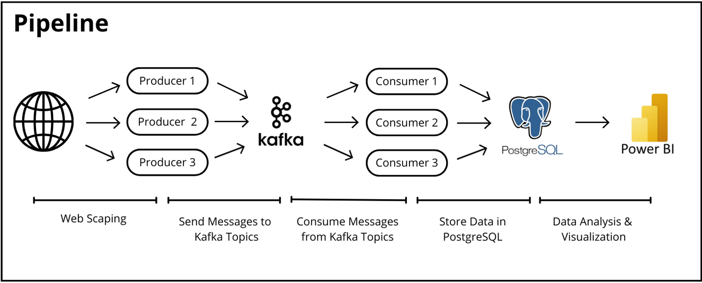
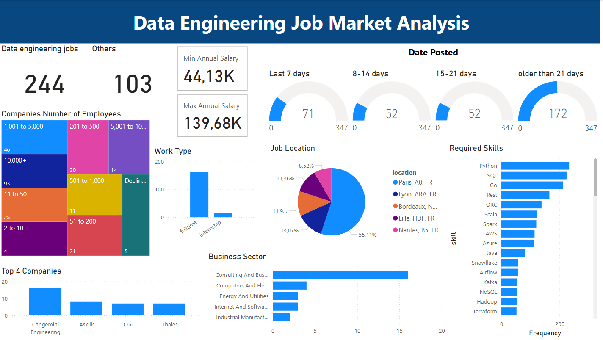

# Data-Engineering-Job-Market-Analysis

In the era of big data, efficiently processing and visualizing large datasets in real-time is crucial for data-driven decision-making. In this context, Data Scientists, Data Analysts, and Data Engineers each play a pivotal role. Before Data Scientists and Data Analysts can process data to gain insights or build predictive models, Data Engineers are responsible for creating and maintaining data pipelines. This involves collecting data from various sources, transforming it into a usable format, and ensuring data quality before storing it in data storage systems. By establishing and managing these data pipelines, Data Engineers lay the groundwork for effective analysis and visualization, enabling other roles to derive valuable insights from the data.

As someone interested in a career in Data Engineering, I must understand what skills are needed and explore the Data Engineering opportunities in France.

## Objective 

Develop an end-to-end, real-time data pipeline for collecting, transforming, storing, and visualizing job market data to analyze Data Engineering opportunities in France. This project aims to provide valuable insights into:

- The demand for Data Engineering roles across various industries.
- The most sought-after skills and technologies in the field.
- Key hiring companies and their workforce size.
- Salary trends, including minimum and maximum annual salaries.
- Locations with the highest demand for Data Engineers.
- Job posting trends over time to track hiring patterns.

## Pipeline

## Final Dashboard

## Insights
### General Job Market Overview
- In the last 30 days, There are 244 data engineering jobs available, showing a strong demand for data engineers.
- The minimum annual salary is 44.13K, while the maximum is 139.68K, indicating a significant salary range, possibly based on experience, location, or industry.
### Job Posting Trends
- 71 jobs were posted in the last 7 days, suggesting an active job market with frequent openings.
- A considerable number of postings (172 jobs) are older than 21 days, indicating that some positions take longer to fill or remain unfilled.
### Work Type Distribution
Most jobs are full-time, while internship positions are minimal, suggesting that companies are primarily looking for experienced or long-term employees.
### Job Locations
- Paris dominates the job market, with 55.11% of job postings, making it the primary hub for data engineering opportunities.
- Other cities like Lyon, Bordeaux, Lille, and Nantes also have a fair share of opportunities, but their percentages are significantly lower.
### Company Insights
- The top companies hiring include Capgemini Engineering, Askills, CGI, and Thales, suggesting that consulting and IT services companies are major employers in this field.
- The number of employees per company varies, with 10,000+ employee companies offering the highest number of jobs, followed by companies with 1,001–5,000 employees.
### Industry Insights
- The Consulting & Business sector dominates data engineering job opportunities, suggesting a high demand for data processing and analytics in consulting firms.
### Skills in Demand
- Python, SQL, Go, and REST APIs are the most in-demand skills, emphasizing the need for programming and database expertise.
- Other important technologies include ORC, Scala, Spark, AWS, Azure, Java, and Kafka, suggesting that companies seek expertise in big data frameworks and cloud platforms.